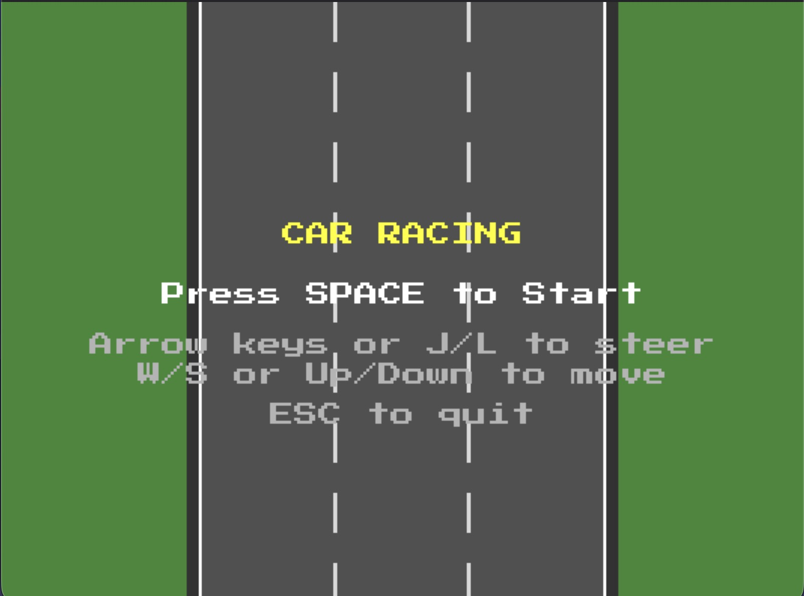
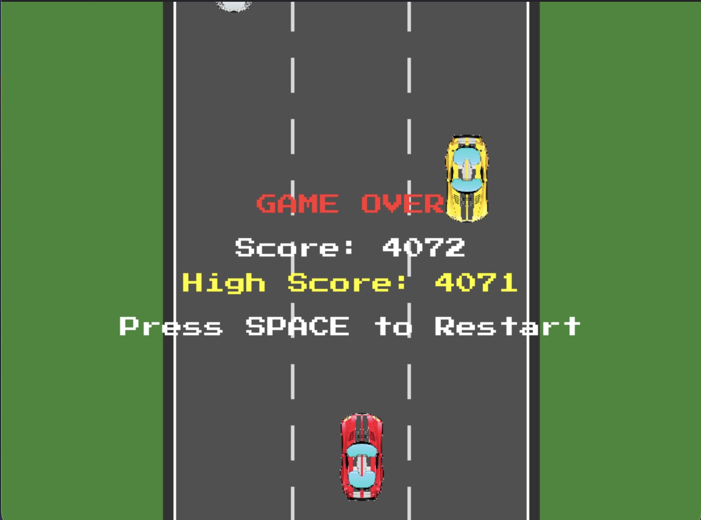
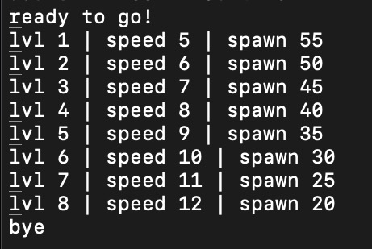

# Car Racing Game

A 2D car racing game built with C and SDL2.

Images:

 

Level Logs on Terminla:



## Prerequisites

- SDL2
- SDL2_image
- SDL2_ttf

Install on macOS:
```bash
brew install sdl2 sdl2_image sdl2_ttf
```

## Build & Run

```bash
make
./car_game
```

## Controls

- **Arrow Keys** or **J/L**: Steer left/right
- **W/S** or **Up/Down**: Move forward/backward
- **SPACE**: Start game / Restart after game over
- **P**: Pause/Resume
- **ESC**: Quit

## Gameplay

Dodge enemy cars, survive as long as possible, and rack up points. Speed and difficulty increase as you progress through levels.

Enjoy the ride!
